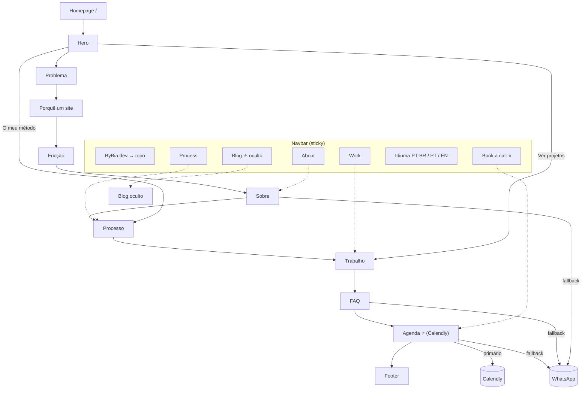

# Arquitetura do Site — ByBia.dev

**Versão v1 — 2026-07-24** | Base: código atual (`src/pages/home`), `product-marketing.md`, specs 04–07

---

## 1. Contexto e tipo de site

- **Tipo:** Small business / solo (landing page **one-page** com navegação por âncoras).
- **Objetivo primário:** conversão — levar o visitante a **agendar uma conversa** (Calendly).
- **Objetivo secundário:** transmitir credibilidade (portfólio + processo + prova) e permitir contacto rápido (WhatsApp).
- **Público:** dono de pequeno negócio / profissional independente (PT-PT, PT-BR, EN).
- **Profundidade:** 1 nível (tudo a 1 clique). Regra dos 3 cliques cumprida com folga.

---

## 2. Mapa de secções (uma página, âncoras)

```
Homepage (/)  —  fluxo em funil de confiança
│
├── Hero                     (topo · logo → "#")        — promessa + CTAs de exploração
├── Problema                 (#problema)                — a dor (cliente invisível)
├── PorqueSite               (#porque-site)             — necessidade (Instagram ≠ site)
├── Friccao                  (#friccao)                 — alívio (não precisa escrever nada)
├── Sobre                    (#sobre)          [nav]    — quem faz + fallback WhatsApp
│   ┄ separador de vidro ┄
├── Processo                 (#processo)       [nav]    — como trabalha (transparência)
├── Trabalho                 (#trabalho)       [nav]    — prova (projetos)
├── FAQ                      (#faq)                     — objeções + fallback WhatsApp
├── Agenda ⭐                 (#agenda)      [nav CTA]   — FECHO: Calendly + fallback WhatsApp
├── Footer                                              — marca / navegação / contacto
└── Blog                     (#blog)           [nav]    — OCULTA (blogReady=false)
```

Ordem = **funil**: dor → necessidade → alívio → quem/como → prova → objeções → **ação**. Vender o "porquê" antes do "quê" (ver `06`).

---

## 3. Sitemap visual



---

## 4. Tabela de âncoras

| Secção | Âncora | Na nav? | Papel | Estado |
|--------|--------|---------|-------|--------|
| Hero | — (`#` topo) | Logo | Promessa + exploração | ✅ |
| Problema | `#problema` | — | Dor | ✅ |
| Porquê um site | `#porque-site` | — | Necessidade | ✅ |
| Fricção | `#friccao` | — | Alívio | ✅ |
| Sobre | `#sobre` | About | Quem faz | ✅ |
| Processo | `#processo` | Process | Como trabalha | ✅ (id corrigido: era `process`) |
| Trabalho | `#trabalho` | Work | Prova | ✅ |
| FAQ | `#faq` | — | Objeções | ✅ |
| **Agenda** | `#agenda` | **CTA** | **Fecho (Calendly)** | ✅ novo |
| Footer | — | — | Marca/nav/contacto | ✅ |
| Blog | `#blog` | Blog | Notas | ⚠️ **oculto** → âncora morta |

---

## 5. Navegação

### Header (sticky, transparente → escuro no scroll)
- **Logo** (esquerda) → topo (`#`).
- **Links (âncoras):** Work · About · Process · ~~Blog~~ (Blog atualmente morto — ver §7).
- **Seletor de idioma:** 🇧🇷 PT-BR · 🇵🇹 PT · 🇬🇧 EN.
- **CTA (direita):** "Agendar conversa" / "Book a call" → `#agenda`.
- Regra 4–7 itens: 4 links + CTA. Ao esconder o Blog fica em 3 + CTA (ideal).

### Footer (funcional, sem CTA duplicado)
- **Marca** + descrição curta.
- **Navegação:** Work · About · Process · Blog.
- **Contacto:** email · GitHub · país.
- **Rodapé legal:** copyright · "feito com código limpo".
- *O bloco CTA foi removido — o fecho vive na secção Agenda, logo acima (evita dois CTAs colados).*

### Breadcrumbs
Não aplicável (one-page).

---

## 6. Arquitetura de conversão (dois caminhos)

| Caminho | Ação | Onde | Quando serve |
|---------|------|------|--------------|
| **Primário — "job done"** | Agendar (Calendly) | Secção Agenda + navbar CTA → `#agenda` | Cliente pronto para falar; quer resolver agora, sem esperar resposta |
| **Fallback — conversa rápida** | WhatsApp (deep link pré-preenchido) | Dentro da Agenda, FAQ, Sobre; nav em pré-launch | Dúvida rápida; prefere mensagem antes de marcar |
| **Exploração** | Âncoras internas | Hero ("Ver projetos" → `#trabalho`, "O meu método" → `#processo`) | Ainda a avaliar |

**Princípio:** os botões prominentes (navbar, Agenda) levam ao **agendamento**; o WhatsApp fica como opção suave em pontos contextuais. Antes, tudo ia ao WhatsApp (sem automação → espera). Agora o Calendly dá a sensação de "resolvido" mesmo antes da data marcada.

> **Config:** o link do Calendly é o placeholder `CALENDLY_URL` em `src/pages/home/components/Agenda.tsx` — trocar pelo link real (única edição necessária). Tema da marca via `primary_color=534AB7`; idioma opcional via `&locale=pt`.

---

## 7. Auditoria de linking e âncoras

- ✅ **Corrigido:** Processo tinha `id="process"` mas a nav aponta `#processo` — link partido, agora alinhado.
- ✅ **Corrigido:** o link "Blog" (nav + footer) apontava para a secção oculta (`blogReady=false`) → âncora morta. Agora o link Blog só aparece quando `blogReady=true` (condicionado por prop em `Navbar` e `Footer`). Com o blog desligado, a nav fica em 3 links + CTA (ideal).
- ✅ **Scroll suave nos cliques:** adicionado `scroll-behavior: smooth` no CSS (`index.css`) → âncoras nativas (nav/CTA) rolam de forma fluida, sem JS. Respeita `prefers-reduced-motion` (força `auto`).
- ✅ **Deep-link `/#agenda`:** scroll-on-mount em `page.tsx` que espera o layout estabilizar (imagens acima carregam depois do 1.º paint e deslocam o alvo) e SALTA para a secção (`behavior: "instant"` — fiável e esperado num link direto).
- **Nota de verificação:** o browser de automação (CDP) usado nos testes tem o smooth-scroll desativado (até `scrollTo({behavior:'smooth'})` fica a 0; só `'instant'` mexe; `prefers-reduced-motion:false`). Por isso a **fluidez dos cliques não foi verificável no ambiente de teste** — confirmar num browser normal. O deep-link (instantâneo) foi verificado.
- ✅ Sem páginas órfãs (one-page; todas as secções alcançáveis por scroll; as principais também por nav/CTA).
- ✅ Âncoras internas com texto descritivo (labels claros), não "clique aqui".

---

## 8. i18n / região

- **Trilingue** (PT-PT, PT-BR, EN) via ficheiros modulares em `src/i18n/local/<lang>/` (`hero`, `footer`, `funil`, `agenda`) — carregados por glob.
- **Geografia como variável** (opção B, ver `05`): copy neutra ("em Portugal" / "your area"), pronta para localizar sem reescrever o site. Sem foco em Bragança (mudança para Figueira da Foz).
- **Voz nativa por idioma** (não tradução literal) — ver `06`/`05`.

---

## 9. Roadmap de expansão (quando deixar de ser one-page)

Se/quando crescer para multi-página, padrão de URLs sugerido:

| Página | URL | Origem hoje |
|--------|-----|-------------|
| Home | `/` | atual |
| Arquivo de projetos | `/projetos` | link "Ver o arquivo completo" no Trabalho |
| Caso de estudo | `/projetos/{cliente}` | prova real (quando existir) |
| Blog | `/blog` · `/blog/{slug}` | secção Blog (hoje oculta) |
| Preços | `/precos` | secção Pacotes (bloqueada até fechar preço — ver `05`) |
| Legal | `/privacidade` · `/termos` | RGPD (obrigatório PT) |

Enquanto for one-page, manter tudo em `/` com âncoras. Migrar para multi-página só quando houver volume de conteúdo (blog com vários artigos, muitos casos) que justifique SEO por página.

---

## Changelog
- v1 (2026-07-24) — Arquitetura da one-page, sitemap, âncoras, navegação, arquitetura de conversão em 2 caminhos (Calendly primário + WhatsApp fallback), auditoria de âncoras (fix `#processo`, `#blog` morto), roadmap de expansão.
